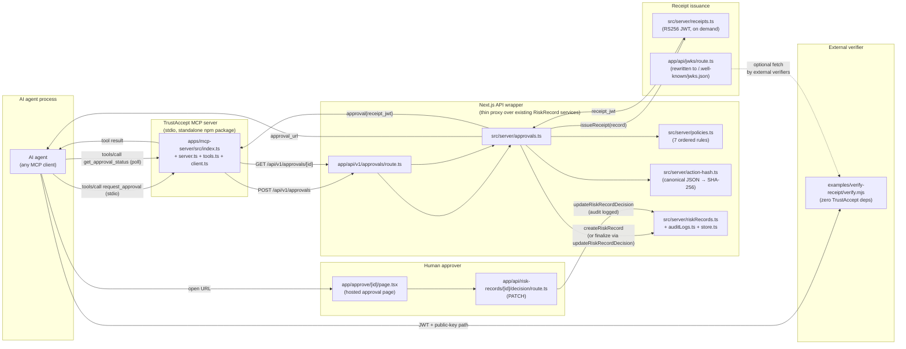

# ARCHITECTURE.md

End-to-end view of how an agent action flows through TrustAccept, from MCP tool invocation to externally-verifiable receipt. Every box in the diagram corresponds to a real file in this repository.

## Flow diagram

## Components and what they produce

### AI agent
Any MCP-capable client. Calls `request_approval` before executing a sensitive action. Halts on `pending` / `rejected`. Proceeds only on `accepted` and, if it's audit-grade infrastructure, captures the `receipt_jwt` for downstream verification.

### TrustAccept MCP server — `apps/mcp-server/`
Standalone npm package. **Three tools, stdio transport only:**
- `request_approval(action, principal, context?, tool_id?)` → `POST /api/v1/approvals`
- `get_approval_status(request_id)` → `GET /api/v1/approvals/[id]`
- `list_pending_approvals(principal?, limit?)` → `GET /api/v1/approvals?status=pending&...`

The MCP server is a thin proxy — it does not import from `src/server/*` or Prisma. It speaks only HTTP to the wrapper. Zod schemas come from `src/lib/approval-types.ts` via cross-package import (single source of truth restored in the Block 3 follow-up commit `0f1d57e`).

Key files: `apps/mcp-server/src/{index,server,tools,client}.ts`.

### Next.js wrapper — `app/api/v1/approvals/`
Three routes:
- `POST /api/v1/approvals` — accepts the locked input shape, evaluates policy, computes action hash, creates the record, finalizes auto-decisions
- `GET /api/v1/approvals` — list with `status` / `principal_*` / `limit` filters
- `GET /api/v1/approvals/[id]` — single record + on-demand receipt JWT

Uses the existing `requireDashboardAccess()` auth. Returns the locked output shape (`ApprovalRecord`) with every reserved field present.

### Policy engine — `src/server/policies.ts`
Seven ordered rules, first match wins. Deterministic. See `examples/submission-assets/POLICY_RULES.md` for the full registry. Returns `{decision, policy_id, risk_level, reason, expires_at_seconds}`. Default expirations by risk level: critical=300s, high=600s, medium=3600s, low=null.

### Action hash — `src/server/action-hash.ts`
`hashAction({type, summary, payload}) → "sha256:<64 hex>"`. Canonical JSON (sorted keys at every depth, arrays preserved, undefined dropped). Reordered payload keys produce identical hashes. Different payload → different hash. The 71-character output fits within the 120-char `externalId` cap on `RiskRecord.sourceReferences`.

### Approval service — `src/server/approvals.ts`
The wrapper's orchestrator. Calls `evaluateApprovalPolicy` and `hashAction`, builds the `RiskRecord` data, calls the existing `createRiskRecord` service to persist. For auto-allow/auto-deny decisions, immediately finalizes via `updateRiskRecordDecision` with a synthetic `policy:{policy_id}` actor so audit logging stays on the existing path. Maps `RiskRecord` → `ApprovalRecord`, calling `issueReceipt` for the receipt JWT.

### Storage — `src/server/{riskRecords,auditLogs,store}.ts`
Existing service layer (predates this MVP). In-memory `Map` for the MVP build; the Prisma schema is in place for a future Postgres switch. `createRiskRecord` creates PENDING records only. `updateRiskRecordDecision` finalizes them and writes the corresponding audit-log row. The wrapper does not bypass either.

### Hosted approval page — `app/approve/[id]/page.tsx`
Publicly readable (the link is the capability for the MVP). Renders:
- Title, description, risk-level badge
- "Policy decision" panel: action type, policy id, action hash (first 16 hex chars + full hash on hover), policy reason
- Compensating controls / evidence summary / business justification / technical context cards
- Source references list
- Approve / Deny buttons (existing `DecisionActions` component)

Mobile-responsive via Tailwind.

### Decision endpoint — `app/api/risk-records/[id]/decision/route.ts` (PATCH)
The existing decision route that the approval page POSTs to. Uses `requireDecisionAccess()` (OWNER / ADMIN / APPROVER). Calls `updateRiskRecordDecision` which writes the decision and the audit-log row atomically.

### Receipt service — `src/server/receipts.ts`
`issueReceipt(record)` returns an RS256-signed JWT for resolved decisions, or `null` if the record is unresolved or `TRUSTACCEPT_RECEIPT_PRIVATE_KEY_PEM` is unset. Generated on demand, never persisted. Uses `node:crypto` — no JWT dependency. Claims include `approval_id`, `agent`, `action_hash`, `policy_id`, `status`, `decided_by` (verbatim from `RiskRecord.decisionBy`), `decision_actor_type`, `decided_at`, `expires_at`, `tenant_id`, `audit_log_ref`, `iss`, `iat`. See `src/server/receipts.md` for the design notes.

### JWKS endpoint — `app/api/jwks/route.ts`
Exposed at `/.well-known/jwks.json` via a Next.js rewrite. Returns the public key in JWK form with `kid`, `alg: "RS256"`, `use: "sig"` populated. Returns HTTP 503 when no signing key is configured.

### External verifier — `examples/verify-receipt/verify.mjs`
Standalone Node 18+ script. **Zero TrustAccept dependencies, zero HTTP calls into TrustAccept** (JWKS fetch is optional and is the only allowed network call). Reads the receipt JWT and a public key (file path, JWKS URL, or env var), verifies the RS256 signature, prints `VERIFIED` + the claims block. Exit 0 / 1 / 2 for success / invalid / usage. This script is the IBM submission's "the receipt stands alone" proof point.

### Production-deploy demo — `examples/production-deploy-gatekeeper/index.mjs`
End-to-end driver that calls the wrapper, prints the approval URL, polls until resolved, and spawns the external verifier against the resulting JWT. README covers setup; `SAMPLE_RUN.md` is a captured live transcript; `RECORDING_PLAN.md` is the shot-by-shot storyboard for the 90-second submission recording.

## Trust boundaries

| Boundary | What crosses | Trust |
|---|---|---|
| Agent ↔ MCP server | Locked-shape JSON-RPC over stdio | The agent must trust whichever MCP server binary the operator installs. |
| MCP server ↔ wrapper | HTTPS in prod / HTTP in dev. Sends the locked input shape verbatim. | The wrapper validates with Zod; the MCP server does not need to be trusted to produce valid shapes. |
| Wrapper ↔ storage | In-memory `Map` for the MVP; Prisma-ready schema in place for Postgres. | Internal to the deployment. |
| Wrapper ↔ approval page | Public URL, no auth required to read; decision endpoint requires `requireDecisionAccess`. | The MVP treats the URL as the capability. Production should sign URLs (post-MVP). |
| Wrapper ↔ external verifier | Receipt JWT (signed). JWKS endpoint (public). | The verifier trusts only the published public key. TrustAccept itself can be unreachable at verification time. |

## What's deliberately NOT in the diagram

- **No notification channels.** WhatsApp / Slack / email / SMS are deferred per the plan. The hosted approval URL is the delivery surface for the MVP.
- **No cancel_approval tool.** The `RiskStatus` enum has no `CANCELLED` value and the plan forbids schema migrations.
- **No tool allowlist enforcement.** `tool_id` is reserved on the input/output shape but the wrapper does not gate on it.
- **No tenant signing keys.** Single env-configured RSA key. Multi-key JWKS is post-MVP.
- **No Streamable HTTP MCP transport.** stdio only for the MVP.
